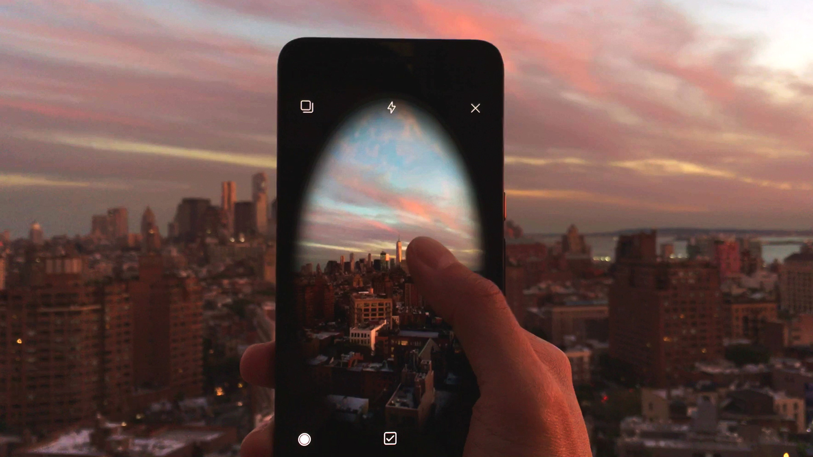

# Sprayscape 

Sprayscape is a perfectly imperfect VR-ish camera. It is an open source Android app released on the Android Experiments platform. 

## Technology
### App
Sprayscape is built in Unity with native Android support. Using the [Google VR SDK for Unity](https://developers.google.com/vr/unity/) to handle gyroscope data and the [NatCam Unity plugin](https://www.assetstore.unity3d.com/en/#!/content/52154) for precise camera control, Sprayscape maps the camera feed on a 360 degree sphere.

The GPU makes it all possible. On user tap or touch, the camera feed is rendered to a texture at 60 frames per second. That texture is then composited with any existing textures by a fragment shader on the GPU. That same shader also handles the projection from 2D camera to a 360 sphere, creating the scape you see in app.

When a user saves a scape, a flat panorama image is stored in the app data and written to a single atlas file containing all scapes. The atlas is loaded into the scapes view the gallery of scapes with gyro navigation.

Sharing is handled by native Android code. When a user shares a scape via link, users sign-in with Google OAuth and are prompted for read and write access on Drive. All user generated content is stored on a user’s Drive account so users can delete their content at any time. With permissions in place, the Drive API v3 checks for a Sprayscape folder, creates one if lacking, and uploads the file. A share URL is presented to the user in a Native Share dialog and is also attached to the scape object on the app for easy sharing at a later date.

Facebook share is also handled natively. The panorama is prepared as an image object with appropriate EXIF data to insure proper presentation on Facebook and then presented to the user via Native Share. User selects Facebook to share to their networks.

### Web Viewer
The web viewer is built using WebGL,  [Three](https://threejs.org/), and the emerging WebVR spec via the [polyfill](https://github.com/borismus/webvr-polyfill) developed at Google by Boris Smus. Using these open standards allows for an adaptive experience across desktops, tablets, and phones. [WebVR](https://webvr.info) support means Sprayscape’s web experience is ready for VR devices: Cardboard, Daydream, Vive, and Oculus. Additional UI and state management is handled by the lightweight [Choo](https://github.com/yoshuawuyts/choo) framework.

## Develop
Some elements are not in the repository, and need to be setup before the Unity project can be built. 

- The NatCam plugin used for the camera feed is not in the repository. You can obtain a license [here](https://www.assetstore.unity3d.com/en/#!/content/52154) and put in `Sprayscape/Assets/NatCam` 
- The file `Secrets.cs` contains the hashing key for sharing. There is a sample file for creating it called `Sprayscape/Assets/Scripts/Secrets.cs.sample` that you can rename. 
- For uploading to Google Drive, you need to set-up an [appengine](https://appengine.google.com) instance, enable the Google Drive API, and set up an OAuth authentication for your keystore signing of the app.

After these steps the app should be ready to be built and run on your device.

## Acknowledgements
[Brian Kehrer](https://github.com/birdimus),
[Troy Lumpkin](https://github.com/troylumpkin),
[Dan Motzenbecker](https://github.com/dmotz),
[Jeramy Morrill](https://github.com/theceremony),
[James Vecore](https://github.com/jamesvecore),
[Norm McGarry](https://github.com/normmcgarry),
[Chris Parker](https://github.com/seep),
[Celso de Melo](https://github.com/CelsoDeMelo),
[Jonas Jongejan](https://github.com/HalfdanJ),
[Glenn Cochon](https://github.com/glenncochon),
[Brendon Avalos](https://github.com/brendonavalos),
[Ryan Burke](https://github.com/ryburke)
